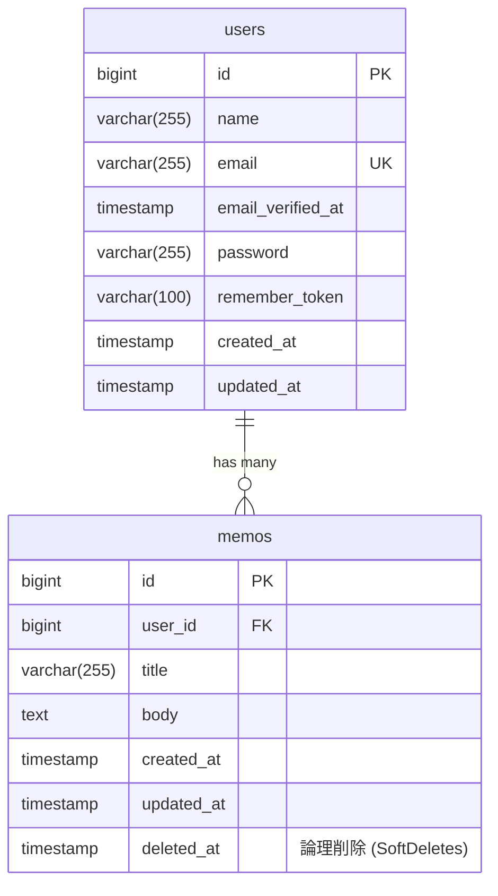

# ER図

```mermaid
erDiagram
    users {
        bigint id PK
        varchar(255) name
        varchar(255) email UK
        timestamp email_verified_at
        varchar(255) password
        varchar(100) remember_token
        timestamp created_at
        timestamp updated_at
    }

    memos {
        bigint id PK
        bigint user_id FK
        varchar(255) title
        text body
        timestamp created_at
        timestamp updated_at
        timestamp deleted_at "論理削除 (SoftDeletes)"
    }

    users ||--o{ memos : "has many"
```
